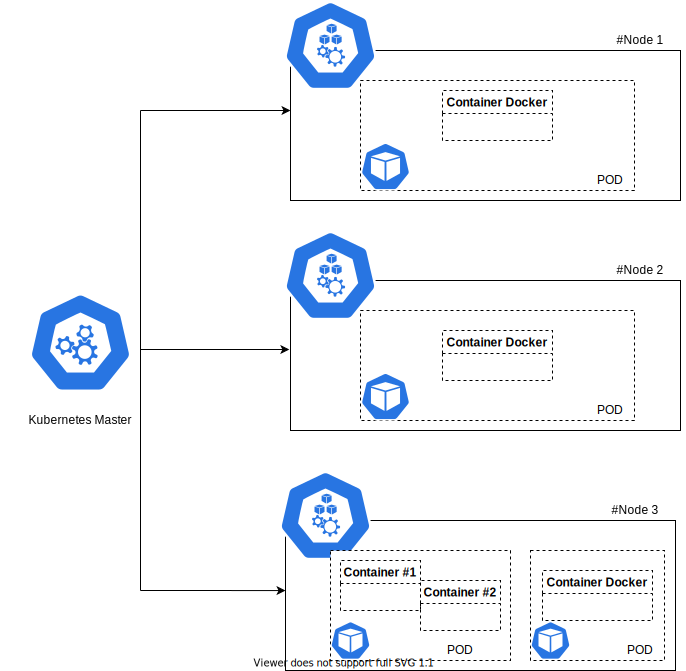

# Memo-Cloud

## Références documentaires

[Outil de diagramme : draw.io](http://draw.io)

[Essentiel Kubernetes](https://www.youtube.com/watch?v=NChhdOZV4sY)

## Docker

## Kubernetes

### Description Kubernetes

Kubernetes : L'orchestrateur le plus populaire pour la gestion des conteneurs.

Le conteneur n'a pas conscience de ce qui se passe en dehors de la machine hôte.

Gérer les différents conteneurs sur ces différents hôtes linux qu'ils soient physiques ou virtuels.

### Kubernetes permet de : 

* Créer des services applicatifs sur plusieurs conteneurs

* Planifier leur execution sur plusieurs conteneurs

* Garantir leur intégrité

* Assurer le monitoring

### Les composants majeurs de l'architecture de Kubernetes

Il y a le **Kubernetes Master** qui est le serveur controlant les nodes

